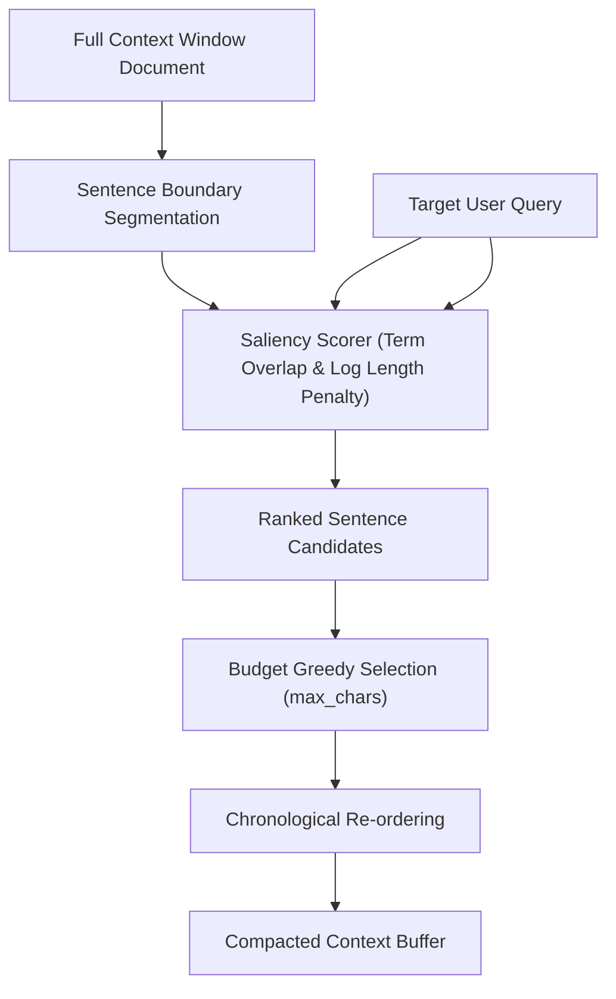

# genpark-context-window-chunk-compressor-skill

Agent Skill implementing **Context Window Pruning & Semantic Saliency Compaction** in 100% Python standard library.

## Architectural Flow

```mermaid
flowchart TD
    Large["Full Context Window Document"] --> Split["Sentence Boundary Segmentation"]
    Query["Target User Query"] --> Scorer["Saliency Scorer (Term Overlap & Log Length Penalty)"]
    Split & Query --> Scorer
    Scorer --> Sorted["Ranked Sentence Candidates"]
    Sorted --> Knapsack["Budget Greedy Selection (max_chars)"]
    Knapsack --> Chrono["Chronological Re-ordering"]
    Chrono --> Comp["Compacted Context Buffer"]
```
